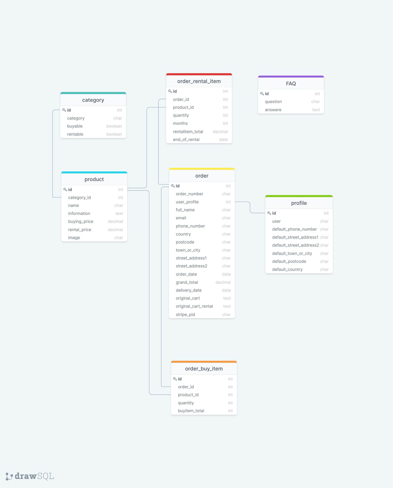

#    Hire Hens

Do you dream about fetching fresch eggs, from your own hens! **Hire Hens**, is the easy way to live your dream and try out having hens in your own backyard. We will help you with the "how to" and the equipment you need. If you later on, or immediately, decides to buy hens instead - we can help you!
 
## UX
### Strategy Plane
#### Site owner's goal
- Sell rental packages including hens and accessories.
- Sell hens, coops, equipment and consumables fitted for hens.
- Being able to update the information of the page.
- Being able to administrate orders

#### External user's goal
- Hire hens and accessories, as coop, feeders and waterers.
- Find information:
    - How to hire hens.
    - What a package consists of.
    - How to take care of the hens.
    - How long it is possible to hire and what happens after the hire.
- Buy hens, coops, equipment and consumables.

**Site owners need**
- That it is easy for a user to hire hens and accessories.
- That is easy for a user to buy hens, equipment and consumables.
- That it is easy and intuitive to update information on the page.
- Authority to manage information on the page.

**Users** needs:
- Easy and intuitive way to hire hens, coops and equipment.
- Easy to find more information about the rental process and how to take care of a hen.
- Easy to buy hens and accessories.

### Scope Plane
#### User stories
(this is not in priority order)
- US_001: As a user I want to be able to sign up to the site. By doing this I have the possibility to add my personal information and thus paying process will be faster.

- US_002: As a user, I want to be able to login to the site.

- US_003: As a user, I want to be able to log out.

- US_004: As a user, I want to be able to look at the site anonymously, without logging in.

- US_005: As a user, I want to build my own rental package, consisting of hens of my choice and having the possibility to add coop and/or feeder and waterer.

- US_006: As a user, I want to buy hens, coop/s, equipment/s and consumables for hens.

- US_007: As a user, I want to add my rental package to a cart.

- US_008: As a user, I want to add my hens, coop/s, equipment/s and consumable/s, that I want to buy, to a cart.

- US_009: As a user, I want to look at my cart.

- US_010: As a user, I want to checkout my cart.

- US_011: As a user, I want to pay, for the contents in my cart, in a secure way, with a credit card.

- US_012: As a user, I want to be able to buy things even if I am not logged in.

- US_013: As a user, I want to find information about how to hire hens and how to take care of hens.

- US_0014: As an administrator of the site, I want to login with the authority to add, change and delete information on the site.

- US_0015: As an administrator of the site, I want to be able to add, change and delete the type of hens, coops, equipment that can be hired or bought. And add, change and delete consumables that can be bought.

- US_0016: As an administrator of the site, I want to be able to add, change and delete information of renting process and how to take care of the hens.

- US_0017: As an administrator I want to be able to look at the orders and filter to see:
    - which orders have not been delivered yet or when they where delivered.
    - which orders includes with rentals that still is not returned.
    - whick orders includes rental that should be returned within a month.

Use this section to provide insight into your UX process, focusing on who this website is for, what it is that they want to achieve and how your project is the best way to help them achieve these things.

In particular, as part of this section we recommend that you provide a list of User Stories, with the following general structure:
- As a user type, I want to perform an action, so that I can achieve a goal.

This section is also where you would share links to any wireframes, mockups, diagrams etc. that you created as part of the design process. These files should themselves either be included as a pdf file in the project itself (in an separate directory), or just hosted elsewhere online and can be in any format that is viewable inside the browser.

### Structure Plane
- A "homepage" with a picture of hens.
- Navbar with:
    - Brand-image that leads to homepage.
    - Link to page where user can put together rental package.
    - Link to page where user can buy eg. food and beding
    - Link to page with FAQ
    - Link to cart
    - Sign up and Login In, or Log Out
    - Profile page
- Rental package-pages:
    - Start with choosing type of hen and number of hens.
    - Then possibility to add coop and/or feeder and waterer.
    - Information of what package consists of and possibility to start subscription.
    - User with administrator authority can add, change or delete type of hens.
    - User with administrator authority can add, change or delete accessories as eg coop, feeder...
- Buy-page:
    - User can buy food, beding and other consumeables.
    - Possibility to add consumeables to cart.
    - User with administrator authority can add, change or delete consumable.
- FAQ-page:
    - Questions and answeres to frequently asked questions.
    - User with administrator authority can add, change or delete questions and answeres.
- Cart page:
    - Information what the cart consists of and possibility to change it.
    - Link to checkout page.
- Checkout page:
    - Possibility to pay with card.
    - If user is logged in,  personal information is given.
    - If anonymous user, user has to fill in information necessary to pay.
- Profile page:
    - Page where user can add and change personal information.

### Skeleton Plane
- The user browses via the navigation system.
- To hire hens, the user is led through the process:
    - first choosing hens (which is mandatory)
    - then coop
    - and then equipment as feeder and waterer
    - add the package to a cart
    - and finally pay for the content of the cart.
- User can go to cart and see its content. User can change and delete content in cart.
- Interactive design that works on Mobile, Tablet as well as Desktop.

#### Wireframes
- [Mobile](https://github.com/Carina-P/hire-hens/blob/master/wireframes/wireframes_mobile.png)
- [Tablet](https://github.com/Carina-P/hire-hens/blob/master/wireframes/wireframes_tablet.png)
- [Desktop](https://github.com/Carina-P/hire-hens/blob/master/wireframes/wireframes_desktop.png)

##### Major changes compared to wireframes

#### Information Architecture
##### Database Choice
- Development phase: SQLight which is installed with Django
- Production phase (deployed): PostgreSQL, provided as an add-on by Heroku

##### Data modell
The data modell was visualised with [DrawSQL](https://drawsql.app/):

#### Design Choices
##### Fonts
For this project, **IBM Plex Serif** is chosen to give a rural experience. The font is picked from [Google Fonts](https://fonts.google.com/). It is a friendly style which fits both web and mobile interfaces, and even in print.
As the fallback font in case IBM Plex Serif isn't being imported into the site correctly, **Roboto** and **Open Sans** are chosen.

##### Colours

- Black: #000000
- White: #FFFFFF
- Different shades of blue: #AFC1D5, #D7E0DA, #F2F5F8
- Green: #A3C284
Black and white are used to get a modern apperance and to get a good contrast. 
Blue and green was choosen as the hens are able to be outside under the blue sky and on the green grass. 

## Features

In this section, you should go over the different parts of your project, and describe each in a sentence or so.
 
### Existing Features
### Responsive

### Features Left to Implement

## Technologies Used
### Languages
- [HTML](https://developer.mozilla.org/en-US/docs/Web/HTML) 
    - To structure the web content
- [CSS](https://developer.mozilla.org/en-US/docs/Web/CSS) 
    - To describe the web page's appearance/presentation
- [JavaScript](https://www.javascript.com/)
    - Bringing interactivity and logic to the site.
- [Python](https://www.python.org)
    - To manage logic and information on server side

### Frameworks, Libraries and other tools
- [Django](https://www.djangoproject.com/)
    - Used as the main framework, to increase productivity.
- [GitPod](https://gitpod.io/)
    - Used for version control by utilizing the GitPod terminal to
    commit to Git and push to GitHub and Heroku.
- [Heroku](https://www.heroku.com/home)
    - To host the web app
- [GitHub](https://github.com)
    - GitHub is used to store the code.
- [Balsamiq Wireframes](https://balsamiq.com/)
    - For designing the wireframes
- [DrawSQL](https://drawsql.app/)
    - To draw database diagrams
- [Google Fonts](https://fonts.google.com/)
    - Fonts are fetched from this site.
- [Favicon](https://favicon.io/)
    - to generate Favicon
- [removebg](https://www.remove.bg/)
    - to change background colour of homepage background image.

DONE THIS FAR!
----------------------------------------------------------------------------

## Testing

OBS!!!
för att lösa problemet med att addera månader till ett datum https://serge-m.github.io/posts/add-months-to-datetime-in-python/

In this section, you need to convince the assessor that you have conducted enough testing to legitimately believe that the site works well. Essentially, in this part you will want to go over all of your user stories from the UX section and ensure that they all work as intended, with the project providing an easy and straightforward way for the users to achieve their goals.

Whenever it is feasible, prefer to automate your tests, and if you've done so, provide a brief explanation of your approach, link to the test file(s) and explain how to run them.

For any scenarios that have not been automated, test the user stories manually and provide as much detail as is relevant. A particularly useful form for describing your testing process is via scenarios, such as:

1. Contact form:
    1. Go to the "Contact Us" page
    2. Try to submit the empty form and verify that an error message about the required fields appears
    3. Try to submit the form with an invalid email address and verify that a relevant error message appears
    4. Try to submit the form with all inputs valid and verify that a success message appears.

In addition, you should mention in this section how your project looks and works on different browsers and screen sizes.

You should also mention in this section any interesting bugs or problems you discovered during your testing, even if you haven't addressed them yet.

If this section grows too long, you may want to split it off into a separate file and link to it from here.

## Deployment

This section should describe the process you went through to deploy the project to a hosting platform (e.g. GitHub Pages or Heroku).

In particular, you should provide all details of the differences between the deployed version and the development version, if any, including:
- Different values for environment variables (Heroku Config Vars)?
- Different configuration files?
- Separate git branch?

In addition, if it is not obvious, you should also describe how to run your code locally.

### Heroku Deployment (using GitHub) with AWS and Postgres
Take the following steps to deploy my site onto [Heroku](https://hire-hens.herokuapp.com/):
1. I installed gunicorn, psycopg2-binary and dj-database-url using [PIP]((https://pypi.org/project/pip/).
2. Then I saved all versions of Python libraries need for the application in the file requirements.txt, using command: `pip3 freeze > requirements.txt` in the terminal.
Since I have put all required libraries in requirements.txt, you just have to run: `pip3 install -r requirements.txt` in your terminal.
3. Create a Procfile, with content: `web: gunicorn hire_hens.wsgi:application`
4. Then give the following commands in the terminal to save changes and push them to GitHub repository:
    - `git add .`
    - `git commit -m"Created requirements and Procfile"`
    - `git push`
5. Logged into your Heroku account (if you do not have one you need to create one: [Heroku](https://id.heroku.com/) ) and created a new app. I called mine hire-hens.
6. In Resource tab search for Postgres in the Add-ons search bar. Add Heroku Postgres and  selected account, I use the Free account, and submit.
7. In Settings tab click Reveal Config vars and add the following values:

|Key|Value|
|---|---|
|AWS_ACCESS_KEY_ID|`Your aws access key`|
|AWS_SECRET_ACCESS_KEY|`Your aws secret key`|
|DATABASE_URI|`Database URI credentials`|
|DISABLE_COLLECT_STATIC|`1`|
|EMAIL_HOST_PASS|`Your email password(generated by gmail)`|
|EMAIL_HOST_USER|`Your email address`|
|SECRET_KEY|`The secret key you decide/generate`|
|STRIPE_PUBLIC_KEY|`Your stripe public key`|
|STRIPE_SECRET_KEY|`Your stripe secret key`|
|STRIPE_WH_SECRET|`Your stripe webhook key`|
|USE_AWS|`True`|
8. In the Deploy tab, at Deployment method, in Heroku, select GitHub. And then set up automatic deploys at Autmatic deploys.
9. Log in to heroku from your terminal: `heroku login -i` and give your email and password.
10. Makemigrations in heroku database with following command in terminal: `heroku run python3 manage.py makemigrations -a "name of the app in heroku`
11. Push this to heroku with: `git add .`, `git commit` and `git push`
12. Migrate the database: `heroku run pythons3 migrate -a "name of the app in heroku`
13. Create a new superuser in database using the folowing command in terminal: `heroku run python3 manage.py createsuperuser -a "name of the app in heroku` and enter email, username and password.
14. The following settings i settings.py connects to the right database:
`if 'DATABASE_URI' in os.environ:
    DATABASES = {
        'default': dj_database_url.parse(
            os.environ.get('DATABASE_URI')
            )
    }
else:
    DATABASES = {
        'default': {
            'ENGINE': 'django.db.backends.sqlite3',
            'NAME': (os.path.join(BASE_DIR, 'db.sqlite3')),
        }
    }
`
15. Check in settings ALLOWED_HOSTS that the right heroku host is given. In my case the setting is: `ALLOWED_HOSTS = ['hire-hens.herokuapp.com', 'localhost']`
16. In Stripe at tab Developers and then webhooks, register the URL endpoint for checkout webhooks. In my case: `https://hire-hens.herokuapp.com/checkout/wh/`
17. To make email work in production environment you have to have the following settings in settings.py. In your local environment you se "emails" in your terminal:
`if 'DEVELOPMENT' in os.environ:
    EMAIL_BACKEND = 'django.core.mail.backends.console.EmailBackend'
    DEFAULT_FROM_EMAIL = 'hire.hens@gmail.com'
else:
    EMAIL_BACKEND = 'django.core.mail.backends.smtp.EmailBackend'
    EMAIL_USE_TLS = True
    EMAIL_PORT = 587
    EMAIL_HOST = 'smtp.gmail.com'
    EMAIL_HOST_USER = os.environ.get('EMAIL_HOST_USER')
    EMAIL_HOST_PASSWORD = os.environ.get('EMAIL_HOST_PASS')
    DEFAULT_FROM_EMAIL = os.environ.get('EMAIL_HOST_USER')`
18. Make sure all settings are commited to GitHub and Heroku.

### Amazon web services (aws)
The static and media files for the deployed site are hosten in the AWS S3 bucket.
1. You need an account in aws and a S3 bucket. Guidelines [here](https://docs.aws.amazon.com/AmazonS3/latest/userguide/creating-bucket.html).
2. Under permissions I turned of "block all public access" and used the following CORS configuration:
`[
    {
        "AllowedHeaders": [
            "Authorization"
        ],
        "AllowedMethods": [
            "GET"
        ],
        "AllowedOrigins": [
            "*"
        ],
        "ExposeHeaders": []
    }
]`
3. Create a folder media/ and a folder static/. 
4. Copy all media files to the S3 bucket media/ folder. The static files are taking care of when code is pushed to GitHub and Heroku. 
5. In order to connect to the S3 bucket (back at the terminal) the boto3 and django-storages must be installed. I used `pip3 install` and them added to requirements.txt with `pip3 freeze > requirements.txt`. All required packeges is allready in requirements.txt so you can run `pip3 install -r requirements.txt` in your terminal.
6. Make sure 'storages is in the list of INSTALLED_APPS in settings.py.
7. In settings.py the following settings must be present:
`if 'USE_AWS' in os.environ:
    # Cache control
    AWS_S3_OBJECT_PARAMETERS = {
        'Expires': 'Thu, 31 Dec 2099 20:00:00 GMT',
        'CacheControl': 'max-age=94608000',
    }

    # Bucket config
    AWS_STORAGE_BUCKET_NAME = 'hire-hens'
    AWS_S3_REGION_NAME = 'eu-north-1'
    AWS_ACCESS_KEY_ID = os.environ.get('AWS_ACCESS_KEY_ID')
    AWS_SECRET_ACCESS_KEY = os.environ.get('AWS_SECRET_ACCESS_KEY')
    AWS_S3_CUSTOM_DOMAIN = f'{AWS_STORAGE_BUCKET_NAME}.s3.amazonaws.com'

    # Static and media files
    STATICFILES_STORAGE = 'custom_storages.StaticStorage'
    STATICFILES_LOCATION = 'static'
    DEFAULT_FILE_STORAGE = 'custom_storages.MediaStorage'
    MEDIAFILES_LOCATION = 'media'

    # Override static and media URLs in production
    STATIC_URL = f'https://{AWS_S3_CUSTOM_DOMAIN}/{STATICFILES_LOCATION}/'
    MEDIA_URL = f'https://{AWS_S3_CUSTOM_DOMAIN}/{MEDIAFILES_LOCATION}/'
`
8. Delete the DISABLE_COLLECTSTATIC from Heroku Settings, Config Var.
10. Push all changes to GitHub and Heroku.

## Credits

### Content
- The text for section Y was copied from the [Wikipedia article Z](https://en.wikipedia.org/wiki/Z)

### Media
- The photos used in this site were obtained from:
    - Egg in logo: [pixabay](https://pixabay.com/sv/vectors/%C3%A4gg-oval-mat-omg%C3%A5ngen-157224/)
    - Chickens on home page: [pixabay](https://pixabay.com/sv/photos/kyckling-tupp-h%C3%B6na-kycklingar-p%C3%A5sk-4849979/) by [Danganhfoto](https://pixabay.com/sv/users/danganhfoto-14195971/. The background colour is changed from original.
    - Brahma hen: [pixabay](https://pixabay.com/sv/photos/brahma-h%C3%B6na-h%C3%B6na-brahma-g%C3%A5rd-4046755/) by [Emma_Ted](https://pixabay.com/sv/users/emma_ted-1979297/)
    - Guinea fowl hen: [pixabay](https://pixabay.com/sv/photos/p%C3%A4rlh%C3%B6ns-arter-1165114/) by [Pixel-mixer](https://pixabay.com/sv/users/pixel-mixer-1197643/)
    - Bantam hen: [pixabay](https://pixabay.com/sv/photos/kyckling-bantam-inhemsk-kyckling-5500417/) by [Jeannette1980](https://pixabay.com/sv/users/jeannette1980-15621666/)
    - The rest of the pictures used on the site are developers private photos. Please do not use without permission.

### Acknowledgements

- I received inspiration for this project from:
    - Code institute Boutique Ado.
    - [Bootstrap](https://getbootstrap.com/)
    - Sticky footer from [Sticky Footer, Five Ways](https://css-tricks.com/couple-takes-sticky-footer/)