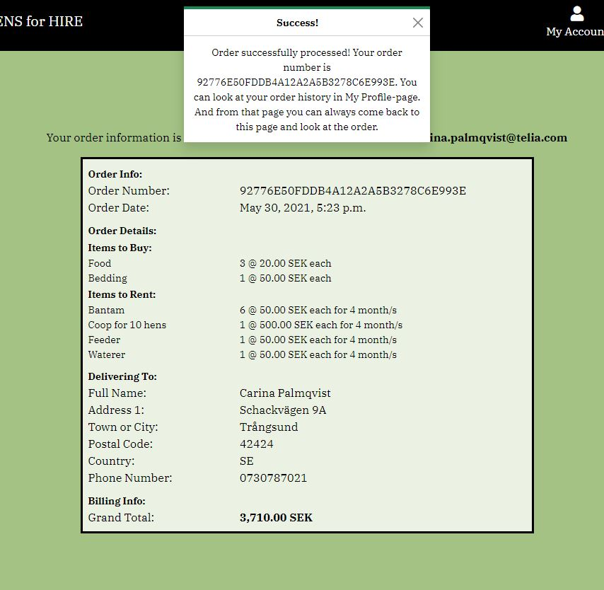

#    Hens for Hire

Do you dream about fetching fresh eggs, from your own hens! **Hens for Hire**, is the easy way to live your dream and try out having hens in your own backyard. We will help you with the "how to" and the equipment you need. If you later on, or immediately, decides to buy hens instead - just go ahead!

The live project can be found here: [https://hire-hens.herokuapp.com/](https://hire-hens.herokuapp.com/)

**Browser requirements** (at least version)|
|---------------------------|
|Chrome 58|
|Edge 14|
|Firefox 54|
|Safari 10|
|Opera 55|
|Opera mini can not be used|
|IE10|
|iOS 9|
|Android 4.4|
 
## UX
### Strategy Plane
#### Site owner's goal
- Sell rental packages including hens and accessories.
- Sell hens, coops, equipment and consumables fitted for hens.

#### External user's goal
- Hire hens, coops and equipment as feeders and waterers.
- Find information about hens, how to buy or hire and how to take care of them.
- Buy hens, coops, equipment and consumables.

**Site owners need**
- That it is easy for a user to hire hens, coop and equipment (as waterer and feeder).
- That is easy for a user to buy hens, coop, equipment and consumables (as food and bedding).
- Possibilty to add frequently asked questions (FAQ).
- Being able to administer products, orders and FAQs.
- That only people with authority are being able to administer the products, FAQs and orders.

**Users** needs:
- Easy and intuitive way to hire or buy hens, coops and equipment and also buy consumables.
- Easy to find more information about the rental process and how to take care of a hen.
- Easy to buy hens and accessories.

### Scope Plane
#### User stories
(this is not in priority order)
- UC_001: As a user I want to be able to register to the site. By doing this I have the possibility to add my personal information and thus paying process will be faster.

- UC_002: As a user, I want to be able to login to the site.

- UC_003: As a user, I want to be able to log out.

- UC_004: As a user, I want to be able to look at the site anonymously, without logging in.

- UC_005: As a user, I want to build my own rental package for a specific number of months, having the possibility to add hens, coop and/or other equipment.

- UC_006: As a user, I want to add products that I want to buy to the cart.

- UC_007: As a user, I want to look at my cart and then continue shopping.

- UC_008: As a user, I want to change quantity or remove item in cart.

- UC_009: As a user, I want to checkout my cart.

- UC_010: As a user, I want to return from the checkout page to my cart and do some adjustments.

- UC_011: As a user, I want to pay, for the contents in my cart, in a secure way, with a credit card.

- UC_012: As a user that is logged in I want to be able to save my delivery and contact information to be shown in checkout form every time I checkout.

- UC_013: As a user, I want to be able to see my profile information with my order history. 

- UC_014: As a user, I want to find information about e.g. how to hire hens and how to take care of hens.

- UC_015: As the administrator of the site I want to be able to login and manage products - add, change and/or delete.

- UC_016: As the administrator of the site I want to be able to login and manage FAQs (frequently asked questions) - add, change and/or delete.

- UC_017: As an administrator I want to be able to look at the orders and filter them to see:
    - which orders have not been delivered yet
    - which orders includes rentals that is not returned and be able to see if they are overdue.

- UC_018: As an administrator I want to be able to mark an order that has no delivery date as delivered.

- UC_019: As an administrator I want to be able to mark a rental item that has a due date as returned.

### Structure Plane
- A "homepage" with a picture of hens.
- Navbar with:
    - Brand-image that leads to homepage.
    - Link to page where user can rent products.
    - Link to page where user can buy products.
    - Link to page with FAQ
    - Link to cart
    - Link to register and login in, or log out
    - Link to profile page
    - For administrators only an link to administer:
        - products
        - orders
        - FAQs
- Rental-page
    - One page for each category(Hens, Coops and Equipment) of products.
    - One page for each product with more detailed information and possibility to add to cart. This page is reached from the category of products page.
- Buy-page:
    - One page for each category( Hens, Coops, Equipment and Consumables) of products.
    - One page for each product with more detailed information and possibility to add product to cart. This page is reached from the category of products page.
- FAQ-page:
    - Questions and answers to frequently asked questions.
- Cart-page:
    - Information what the cart consists of and possibility to change its content. Cart consists of a rental part and a part with items to buy.
    - Link to checkout page.
- Checkout page:
    - Possibility to pay with card.
    - If user is logged in,  personal information is given.
    - If anonymous user, user has to fill in information necessary to pay.
- Order confirmation page:
    - A confirmation that the order is added to database and information what the order consists of.
- Profile page:
    - Page where user can add and change personal information. And also se historical orders.
- Administer Products page:
    - Page where user can add, change or delete products.
- Administer orders page:
    - Page where user can filter orders, mark order as delivered and mark rental items as returned.
- Administer FAQ page:
    - Page where user can add, change and delete FAQ.

### Skeleton Plane
- The user browses via the navigation system.
- To hire hens, the user is led through the process:
    - choose hens to add to the cart
    - then coop to add to cart
    - and then equipment as feeder and waterer to add to cart.
    - Through the process the number of months to rent, last choosen, is given as a suggestion for next item to rent. (High probability user wants to rent items the same amount of time.) 
    - after hire equipment user can either go to cart to checkout or go to buy consumables as bedding and food.
- To buy products user choose one item at a time to add to the cart.
- User can always go to cart and see its content and then continue to shop.
- Only User with special authority reaches administrator pages for managing products, orders and FAQs.
- Interactive design that works on Mobile, Tablet as well as Desktop.

#### Wireframes
Wireframes for mobile:
- [mobile](https://github.com/Carina-P/hire-hens/blob/master/wireframes/wireframes_mobile_part1.png)
- [mobile: wireframes for administration](https://github.com/Carina-P/hire-hens/blob/master/wireframes/wireframes_mobile_part2.png)

Wireframes for tablet:
- [tablet](https://github.com/Carina-P/hire-hens/blob/master/wireframes/wireframes_tablet_part1.png)
- [tablet: wireframes for administration](https://github.com/Carina-P/hire-hens/blob/master/wireframes/wireframes_tablet_part2.png)

Wireframes for desktop:
- [Desktop](https://github.com/Carina-P/hire-hens/blob/master/wireframes/wireframes_desktop.png)

##### Major changes compared to wireframes
- Cart: The **Qty column** in the table, on tablets and desktop, in reality contains a "number stepper" and the buttons Update and Delete are also part of the column.
- Calling it Log In, Log Out and Sign Up (not Sign In, Sign Out or Register).

#### Information Architecture
##### Database Choice
- Development phase: SQLight which is installed with Django
- Production phase (deployed): Postgres, provided as an add-on by Heroku

##### Data modell
The data modell was visualised with [DrawSQL](https://drawsql.app/):

In the visualisation the modells Group, Email_address, User and Site is not shown. It is the modells that django provide.
The column types shown in visualization differs in some case from reality. Here is the differenses:
- In Order and Profile, column country have the django fieldtype: CountryField.
- In Order, column order_date and delivery_date are DatetimeFields.
- In Product, column image is an ImageField.
- In OrderRentalItem, column end_of_rental is DatetimeField.

#### Design Choices
##### Fonts
For this project, **IBM Plex Serif** is chosen to give a rural experience. The font is picked from [Google Fonts](https://fonts.google.com/). It is a friendly style which fits both web and mobile interfaces, and even in print.
As the fallback font, in case IBM Plex Serif isn't being imported into the site correctly, **Roboto** and **Open Sans** are chosen.

##### Colours

- Lightgreen, Ivory: #EBF2E4.
- Green, Olivine: #A3C284
- Black: #000000
- White: #FFFFFF
Green as the main color was choosen for a rural feeling and as the thought is that hens should be outside on the green grass.
Buttons, navbar and footer have black background and white text to get a modern apperance and to get a good contrast.
Text in pages is mainly black and the background is lightgreen or white to get good contrast.
For error messages or delete/remove buttons a red color is sometimes used to get attention.

## Features
### Existing Features
This project is highly inspired by the Boutique Ado example from Code Institute. Especially the checkout, checkout success, profile and stripe management appearance and functionality are very close to Boutique Ado. This application uses the allauth applications from Django to administrate user authentication.
The application differs from Boutique Ado in:
- The product and cart parts since user can both rent and buy items. The rental possibility adds the time dimension. 
- FAQ is offered which is not present in Boutique Ado.
- Administrators can filter orders and handle delivery and rental due times.
* Features in all pages:
    * Navbar with possibility to navigate to:
        * Homepage
        * Hire products (you are led to Hens)
        * Buy products (a dropdown is shown where you choose Hens, Coops, Equipment or Consumables)
        * FAQ (frequently asked questions)
        * ADM (only for users with administrators authority)- a dropdown where you can choose between Products, Orders or FAQ.
        *  My Account - if you are logged in you can choose My Profile or Log out. If you are not logged in you can choose between Log in or Register.
        * Cart: Here you can see total sum of products/rentals in cart. Link leads to the cart.

    * Toasts with messages are shown in top of page. They disappear when user closes them or if user interact in other ways in the page or got to other page.

 
    * Footer: With contact information.

**home**
* Home -page: Picture to attract users and possibility to go and Explore rental alternatives.

**products**
* Show rental products within category-page:

    * All products belonging to a category, with general information and possibility to go to product detail page.
    * From Hire in navbar user is guided to product belonging to Hens category page. When hens are added to cart user is guided to Coops and then Equipment.
    * If user is an administrator and is guided to this page from the ADM link in navbar: All products are shown. User can choose to add, change or delete product. When adding or changing a product user is guided to manage product page. When deleting a product a modal is shown asking if user is sure he/she wants to delete the product.

* Show product details page:
    * Gives more information about a product. A possibility to choose number of months (if applicable) and number of items to rent and add to cart.
    * Possibility for user to go to cart.
    * The number of months is saved in context and for every new item to rent, user is presented with the last choosen number of months.

* Manage product page:
    * Add product: User can fill in information about the product in a form and then submit.

    * Change product: User is presented with current information about the product in a form. User can change the information and then submit.

**cart**
* Shopping cart page:
    * User can see both products to buy and products to rent with quantity, number of months and price. Subtotals and Grand totals are calculated and presented.
    * Possibility to go to checkout page.
    * User can change the quantity. If user chooses to remove item from cart a modal is shown that askes if user is sure.

**checkout**
* Checkout page:
    * Form to fill in contact and delivery information. If user is logged in, personal information is already filled in.
    * Credit card information can be added. Validation of credit card information with error messages are shown.
    * An overview of the shopping cart is presented.
    * User can choose to complete order or return to shopping cart.
    * Webhooks is used to communicate with Stripe to be sure no orders are lost due to unintendet behaviour.

* Checkout success page:
    * If payment and order transactions are succesfull the user is guided to this page. Here is information of order number and order details.

* Administrate orders page:
    * Initially all orders are shown. But user can filter to show:
        * All orders
        * Orders that is not delivered yet
        * Order that have rentals due
    * Orders that are not delivered are "marked" with a red Not Delivered.
    * For orders with rental due the date of rental due is shown. Rental due in the future are green and rental due that is late are red.
    * Possibility to choose to se more details about an order. Then user is guided to order details page.

* Order details page:
    * The details for the order with all items to buy and all items to rent.
    * If order there is no delivery date for order in database. Not delivered is shown in red. User is given possibility to add todays date as delivery date.
    * If a rental item has a rental due, the rental due date is shown. The date is red if due date has passed and green if the date is in the future. User has the possibility to "mark" rental as returned.

**profile**
* Profile page:
    * A form with user contact information and delivery information. User can update information and save.
    * An overview of order history and possibility to look at specific order by linking to Checkout success page.

**faq**
* FAQ-page:
    * Frequently asked questions and corresponding answers are shown in an "accordion".

    * If user is an administrator, user can choose to add, change or delete FAQ.

    * If user wants to delete a faq a modal is shown with the question if user is sure.

* FAQ input page:
    * If user is administrator:
        * Add FAQ: A form is presented where user can add question and answere and submit.

        * Change FAQ: Information for a specific FAQ is presented in a form and user can change the information and then submit.

* Register page:
    * User register email, user name, password and repeat of password in a form.

* Sign in page:
    * User give user name and password in a form.

* Log out page:
    * User confirm that he/she wants to log out.

### Responsive
The site is designed to fit devices with screen widths from 320px and larger.
* Navbar collapses into "hamburger" menu on smaller viewports.
* Footer looks different in different viewport sizes.
* In orders administration and cart there is a little arrow in smaller viewports. If user clicks on arrow the user is guided to top of page.

* Almost all of the pages differ between smaller and larger viewport.

### Features Left to Implement
- Sending an email when order is completed.
- Possibility to change full name in Profile page.
- It is prepared to connect social media but it is not completed.

## Technologies Used
### Languages
- [HTML](https://developer.mozilla.org/en-US/docs/Web/HTML) 
    - To structure the web content
- [CSS](https://developer.mozilla.org/en-US/docs/Web/CSS) 
    - To describe the web page's appearance/presentation
- [JavaScript](https://www.javascript.com/)
    - Bringing interactivity and logic to the site.
- [Python](https://www.python.org)
    - To manage logic and information on server side

### Frameworks, Libraries and other tools
- [Django](https://www.djangoproject.com/)
    - Used as the main framework, to increase productivity.
- [GitPod](https://gitpod.io/)
    - Used for version control by utilizing the GitPod terminal to
    commit to Git and push to GitHub and Heroku.
- [Heroku](https://www.heroku.com/home)
    - To host the web app
- [GitHub](https://github.com)
    - GitHub is used to store the code.
- [Bootstrap](https://getbootstrap.com/docs/5.0/getting-started/introduction/)
    - Library for html/css/js features.
- [JQuery](https://jquery.com/)
    - To simplify DOM manipulation.
- [PEP](http://pep8online.com/)
    - to validate python code
- [JSHint](https://jshint.com)
    - to validate JavaScript code
- [Markup Validation Service](https://validator.w3.org)
    - to validate HTML code
- [CSS Validation Service](https://jigsaw.w3.org/css-validator/)
    - to check CSS
- [Balsamiq Wireframes](https://balsamiq.com/)
    - For designing the wireframes
- [Coolors](https://coolors.co/):
    - To generate color-schemes
- [DrawSQL](https://drawsql.app/)
    - To draw database diagrams
- [Google Fonts](https://fonts.google.com/)
    - Fonts are fetched from this site.
- [Favicon](https://favicon.io/)
    - to generate Favicon
- [removebg](https://www.remove.bg/)
    - to change background colour of homepage background image.

## Testing
The tests conducted are detailed in [TESTS.md](https://github.com/Carina-P/hire-hens/blob/master/test/TESTS.md)

## Deployment
### Heroku Deployment (using GitHub) with AWS and Postgres
To deploy the site onto [Heroku](https://hire-hens.herokuapp.com/):
1. I installed gunicorn, psycopg2-binary and dj-database-url using [PIP]((https://pypi.org/project/pip/).
2. Then I saved all versions of Python libraries need for the application in the file requirements.txt, using command: `pip3 freeze > requirements.txt` in the terminal.
Since I have put all required libraries in requirements.txt, you just have to run: `pip3 install -r requirements.txt` in your terminal.
3. Created a Procfile, with content: `web: gunicorn hire_hens.wsgi:application`
4. Then gave the following commands in the terminal to save changes and push them to GitHub repository:
    - `git add .`
    - `git commit -m"Created requirements and Procfile"`
    - `git push`
5. Logged into your Heroku account (if you do not have one you need to create one: [Heroku](https://id.heroku.com/) ) and created a new app. I called mine hire-hens.
6. In Resource tab search for Postgres in the Add-ons search bar. Add Heroku Postgres and  selected account, I use the Free account, and submit.
7. In Settings tab click Reveal Config vars and add the following values:

|Key|Value|
|---|---|
|AWS_ACCESS_KEY_ID|`Your aws access key`|
|AWS_SECRET_ACCESS_KEY|`Your aws secret key`|
|DATABASE_URI|`Database URI credentials`|
|DISABLE_COLLECT_STATIC|`1`|
|EMAIL_HOST_PASS|`Your email password(generated by gmail)`|
|EMAIL_HOST_USER|`Your email address`|
|SECRET_KEY|`The secret key you decide/generate`|
|STRIPE_PUBLIC_KEY|`Your stripe public key`|
|STRIPE_SECRET_KEY|`Your stripe secret key`|
|STRIPE_WH_SECRET|`Your stripe webhook key`|
|USE_AWS|`True`|

8. In the Deploy tab, at Deployment method, in Heroku, select GitHub. And then set up automatic deploys at Autmatic deploys.
9. Log in to heroku from the terminal: `heroku login -i` and give email and password.
10. Makemigrations in heroku database with following command in terminal: `heroku run python3 manage.py makemigrations -a "name of the app in heroku`
11. Push this to heroku with: `git add .`, `git commit` and `git push`
12. Migrate the database: `heroku run pythons3 migrate -a "name of the app in heroku`
13. Create a new superuser in database using the folowing command in terminal: `heroku run python3 manage.py createsuperuser -a "name of the app in heroku` and enter email, username and password.
14. The following settings i settings.py connects to the right database:

`if 'DATABASE_URI' in os.environ:
    DATABASES = {
        'default': dj_database_url.parse(
            os.environ.get('DATABASE_URI')
            )
    }
else:
    DATABASES = {
        'default': {
            'ENGINE': 'django.db.backends.sqlite3',
            'NAME': (os.path.join(BASE_DIR, 'db.sqlite3')),
        }
    }
`
15. Check in settings ALLOWED_HOSTS that the right heroku host is given. In my case the setting is: `ALLOWED_HOSTS = ['hire-hens.herokuapp.com', 'localhost']`
16. In Stripe at tab Developers and then webhooks, register the URL endpoint for checkout webhooks. In my case: `https://hire-hens.herokuapp.com/checkout/wh/`
17. To make email work in production environment you have to have the following settings in settings.py. In your local environment you se "emails" in your terminal:

`if 'DEVELOPMENT' in os.environ:
    EMAIL_BACKEND = 'django.core.mail.backends.console.EmailBackend'
    DEFAULT_FROM_EMAIL = 'hire.hens@gmail.com'
else:
    EMAIL_BACKEND = 'django.core.mail.backends.smtp.EmailBackend'
    EMAIL_USE_TLS = True
    EMAIL_PORT = 587
    EMAIL_HOST = 'smtp.gmail.com'
    EMAIL_HOST_USER = os.environ.get('EMAIL_HOST_USER')
    EMAIL_HOST_PASSWORD = os.environ.get('EMAIL_HOST_PASS')
    DEFAULT_FROM_EMAIL = os.environ.get('EMAIL_HOST_USER')`
18. Make sure all settings are commited to GitHub and Heroku.
19. The categories must exist in the database for the app to work. Open your application and go to admin (/admin) and add the following values to the Category table:

|Category|Buyable|Rentable|
|---|---|---|
|Hens|True|True|
|Coops|True|True|
|Equipment|True|True|
|Consumables|True|False|

### Amazon web services (aws)
The static and media files for the deployed site are hosted in the AWS S3 bucket.
1. You need an account in aws and a S3 bucket. Guidelines [here](https://docs.aws.amazon.com/AmazonS3/latest/userguide/creating-bucket.html).
2. Under permissions I turned of "block all public access" and used the following CORS configuration:
`[
    {
        "AllowedHeaders": [
            "Authorization"
        ],
        "AllowedMethods": [
            "GET"
        ],
        "AllowedOrigins": [
            "*"
        ],
        "ExposeHeaders": []
    }
]`
3. Create a folder media/ and a folder static/. 
4. Copy all media files to the S3 bucket media/ folder. The static files are taking care of when code is pushed to GitHub and Heroku. 
5. In order to connect to the S3 bucket (back at the terminal) the boto3 and django-storages must be installed. I used `pip3 install` and them added to requirements.txt with `pip3 freeze > requirements.txt`. All required packeges is allready in requirements.txt so you can run `pip3 install -r requirements.txt` in your terminal.
6. Make sure 'storages is in the list of INSTALLED_APPS in settings.py.
7. In settings.py the following settings must be present:
`if 'USE_AWS' in os.environ:
    # Cache control
    AWS_S3_OBJECT_PARAMETERS = {
        'Expires': 'Thu, 31 Dec 2099 20:00:00 GMT',
        'CacheControl': 'max-age=94608000',
    }

    # Bucket config
    AWS_STORAGE_BUCKET_NAME = 'hire-hens'
    AWS_S3_REGION_NAME = 'eu-north-1'
    AWS_ACCESS_KEY_ID = os.environ.get('AWS_ACCESS_KEY_ID')
    AWS_SECRET_ACCESS_KEY = os.environ.get('AWS_SECRET_ACCESS_KEY')
    AWS_S3_CUSTOM_DOMAIN = f'{AWS_STORAGE_BUCKET_NAME}.s3.amazonaws.com'

    # Static and media files
    STATICFILES_STORAGE = 'custom_storages.StaticStorage'
    STATICFILES_LOCATION = 'static'
    DEFAULT_FILE_STORAGE = 'custom_storages.MediaStorage'
    MEDIAFILES_LOCATION = 'media'

    # Override static and media URLs in production
    STATIC_URL = f'https://{AWS_S3_CUSTOM_DOMAIN}/{STATICFILES_LOCATION}/'
    MEDIA_URL = f'https://{AWS_S3_CUSTOM_DOMAIN}/{MEDIAFILES_LOCATION}/'
`
8. Delete the DISABLE_COLLECTSTATIC from Heroku Settings, Config Var.
10. Push all changes to GitHub and Heroku.

### Local Deployment
For local deployment follow these steps:
1. In the terminal write: `git clone https://github.com/Carina-P/hire-hens.git` or use [this guide](https://docs.github.com/en/github/creating-cloning-and-archiving-repositories/cloning-a-repository-from-github/cloning-a-repository).
2. Create an env.py-file in the root directory. Add the following to the file:
`import os

os.environ["DEVELOPMENT"] = "True"
os.environ["SECRET_KEY"] = "<Your secret key>"
os.environ["STRIPE_PUBLIC_KEY"] = "<Your stripe public key>"
os.environ["STRIPE_SECRET_KEY"] = "<Your stripe secret key>" 
os.environ["STRIPE_WH_SECRET"] = "<Your Stripe webhook secret key">
`
3. Add env.py to the .gitignore file and the secrets will not be stored in GitHub and Heroku.
4. Migrate the models to database with:
    - `python3 manage.py makemigrations`
    - `python3 manage.py migrate`
5. Create a superuser: `python3 manage.py createsuperuser`
6. You can access the app using the command `python3 manage.py runserver`
7. Run the application and login to the admin (/admin) to fill Category table with information. The following values must be in the table for the app to work:
|Category|Buyable|Rentable|
|---|---|---|
|Hens|True|True|
|Coops|True|True|
|Equipment|True|True|
|Consumables|True|False|

## Credits
### Media
- The photos used in this site were obtained from:
    - Egg in logo: [pixabay](https://pixabay.com/sv/vectors/%C3%A4gg-oval-mat-omg%C3%A5ngen-157224/)
    - Chickens on home page: [pixabay](https://pixabay.com/sv/photos/kyckling-tupp-h%C3%B6na-kycklingar-p%C3%A5sk-4849979/) by [Danganhfoto](https://pixabay.com/sv/users/danganhfoto-14195971/. The background colour is changed from original.
    - Brahma hen: [pixabay](https://pixabay.com/sv/photos/brahma-h%C3%B6na-h%C3%B6na-brahma-g%C3%A5rd-4046755/) by [Emma_Ted](https://pixabay.com/sv/users/emma_ted-1979297/)
    - Guinea fowl hen: [pixabay](https://pixabay.com/sv/photos/p%C3%A4rlh%C3%B6ns-arter-1165114/) by [Pixel-mixer](https://pixabay.com/sv/users/pixel-mixer-1197643/)
    - Bantam hen: [pixabay](https://pixabay.com/sv/photos/kyckling-bantam-inhemsk-kyckling-5500417/) by [Jeannette1980](https://pixabay.com/sv/users/jeannette1980-15621666/)
    - The rest of the pictures used on the site are developers private photos. Please do not use without permission.

### Acknowledgements

- I received inspiration for this project from:
    - Code institute Boutique Ado.
    - [Bootstrap](https://getbootstrap.com/) with its excelllent docs with examples.
    - [Django](https://docs.djangoproject.com/en/3.2/) which also have excellent docs with information and examples.
    - Thanks to [Adam Delancey](https://github.com/adamdelancey/ms4-england-cricket-tickets). The deployment section of his README.md, in project ms4-england-cricket-tickets, inspired me a lot.
    - Sticky footer from [Sticky Footer, Five Ways](https://css-tricks.com/couple-takes-sticky-footer/)
    - Add months to a datetime: [Add months to datetime in python](https://serge-m.github.io/posts/add-months-to-datetime-in-python/)
    - A huge and special thanks to [Simen Daelien](https://www.github.com/eventyret) my mentor at Code Institute. Who is always very commited with lots of energy and knowledge to share.