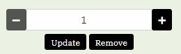

# Test plan
Back to [README](https://github.com/Carina-P/hire-hens/blob/master/README.md)
## Contents

The below plan for testing was followed during development of the site: The TDD, TestDriven Development, process is followed as much as possible. Test cases are developed/thought of, before the code is implemented. The test process is conducted in an iterative manner and implementation cycles are short with small parts of code constructed every time. In some cases, prototyping is used and the thorough test is done when I was satisfied with the prototype.

Before new code is committed, testing of all code developed earlier are repeated again.

When all features are implemented and tested, the following tests are performed:
* Go throught the test cases for functional testing and testing of responsiveness, as described below.
* HTML-code validated by [W3S Markup validation service](https://validator.w3.org/)
* CSS-cod validated by [W3S CSS validation service](https://jigsaw.w3.org/css-validator/)
* JavaScript-code validated by [JSHint](https://jshint.com/)
* Python code is validated by [PEP8](http://pep8online.com/)
* The site is tested on different browsers, as described below
* The deployed version in heroku is tested

## Test of functionality and responsiveness
Functionality tests and tests of responsiveness are done by following test cases below. Test of responsiveness is mainly performed with the help of Chrome Developers Tool.

### Test cases
Test cases are described below and linked to use cases. Each test case have a name beginning with TC and then a number, e.g. TC_001.

* Testing use case **UC_001**. As a user I want to be able to register to the site. By doing this I have the possibility to add my personal information and thus paying process will be faster.:

    **TC_001** Register to the site:
    * How to test:
        * In the navbar choose My Account and then Register.
        * Fill out email, user name and password.
        * Also test to fill in email without an @.
        * Also test to give to different passwords.
    * Expected outcome:
        * A message that a mail is sent with link for verification. When you get the mail and follow the verification your should get the possibility to login.
        * If you give email without @ or two different passwords you will be informed that they are wrong and not have possibility to register.

* Testing use case **UC_002**. As a user, I want to be able to login to the site:

    **TC_002** Log in to the site:
    * How to test:
        * In navbar choose My Account and Log in.
        * Fill in user name and password.
        * Also test to give wrong user name.
        * Also test to give wrong password.
    * Expected outcome:
        * You are logged in to site and guided to homepage.
        * If you give wrong user name or password you get an error message and are not logged in.

* Testing use case **UC_003**. As a user, I want to be able to log out.

    **TC_003** Log out:
    * How to test:
        * Go to navbar, choose My Account and Log out.
    * Expected outcome: 
        * You are guided to log out-page and are asked if you are sure.
        * If you click yes you get a message that you are logged out and are guided to home page.

* Testing use case **UC_004**. As a user, I want to be able to look at the site anonymously, without logging in.

    **TC_004** Go through all the steps to add an order to the system without logging in.
    * How to test:
        * Be sure you are not logged in.
        * In navbar choose Hire.
        * Add 10 brahma hens for 4 months to the cart.
        * Add a coop for 10 hens for 4 months to the cart.
        * Go to buy consumables and add bedding to cart.
        * Go to cart.
        * Choose checkout.
        * Fill in form and checkout.
    * Expected outcome:
        * You should be able to go through all the steps and add an order without problem.

* Testing use case **UC_005**. As a user, I want to build my own rental package, consisting of hens of my choice and having the possibility to add coop and/or feeder and waterer.

    **TC_005** Add hens, coop and waterer, with same amount of months for rental, in cart.
    * How to test:
        * Choose Hire in navbar.
        * Choose Lohman hens.
        * Add 10 hens for 5 months to cart.
        * Choose coop for 10 hens.
        * Do not change months and add 1 coop.
        * Choose waterer
        * Do not change months and add 2 waterers to cart.
        * Go to cart.
    * Expected outcome:
        * In cart you should find 10 Lohman hens, 1 coop for 10 hens and 2 waterers in the cart. And all should have 5 months as rental lenght.
        * Carefully check all the prices, subtotals and grand total.

* Testing use case **UC_006**. As a user, I want to add products that I want to buy to the cart.

  **TC_006** Add hens, coop, waterer, feeder, food and bedding to buy in shopping cart.
    * How to test:
        * In navbar choose buy and Hens
        * Choose Brahma hen
        * Add 4 hens to cart
        * In navbar choose buy and coop
        * Choose coop for 2 hens
        * Add 2 coops to cart
        * In navbar choose buy and equipment
        * Choose feederS
        * Add 2 feeders to cart
        * Choose waterer
        * Add 1 waterer to cart
        * In navbar choose buy and consumables
        * Choose food
        * Add 5 to cart
        * Choose bedding
        * Add 1 to cart
        * Go to cart
    * Expected outcome:
        * In the cart you should see 4 Brahma hens, 2 coops for 2 hens, 2 feeders, 1 waterer, 5 pieces of food and 1 bedding.
        * Carefully check all the prices, subtotals and grand total

* Testing use case **UC_007**. As a user, I want to look at my cart and then continue shopping.

    **TC_007** Add items to cart, go to the cart and look and then continue adding items to the cart.
    * How to test:
        * Fill a cart as in TC_005.
        * Go to cart.
        * In navbar choose hire
        * Choose Lohman hen
        * Add 2 Lohman hens for 5 months to cart.
        * Choose coop for 10 hens
        * Add 1 coop for 2 months to cart
        * Choose Buy and Consumables in navbar
        * Choose food
        * Add 2 pieces to cart
        * Go to cart
    * Expected outcome:
        * Check carefully that you have:
            * rent: 12 Lohman hens for 5 months
            * rent: 1 coop for 10 hens for 5 months
            * rent: 1 coop for 10 hens for 2 months
            * rent: 2 waterers for 5 months
            * buy: 2 pieces of food
        * Also check prices, subtotals and Grand total.

* Testing use case **UC_008**. As a user, I want to change quantity or remove items in cart.

    **TC_008** Add items to cart according to TC_007 and do adjustments to the cart
    * How to test:
        * Follow the steps in how to test TC_007.
        * In cart add 1 more piece of food and click update.
        * Remove the 12 Lohman hens by clicking Remove and answer yes to question if you want to remove.
    * What to expect:
        * You shoud now have 3 pieces of food in your cart
        * And you should not have any hens.
        * Carefully check subtotals and grand totals.
    
* Testing use case **UC_009**. As a user, I want to checkout my cart.

    **TC_009** Checkout cart from TC_007
        * How to test:
            * Log in to the site.
            * Complete the steps in how to test from TC_007
            * Go to checkout page and fill out the form.
            * Save the delivery information in the form.
    * What to expect:
        * You should have a filled out form in checkout page 
        * You should also have an order summary that consists of:
            * rent: 12 Lohman hens for 5 months
            * rent: 1 coop for 10 hens for 5 months
            * rent: 1 coop for 10 hens for 2 months
            * rent: 2 waterers for 5 months
            * buy: 2 pieces of food
        * Please carefully check subtotals and grand totals.
    
    **TC_010** Give wrong credit card number.
    * How to test
        * Complete all steps according to TC_009
        * Fill out form in checkout page but give wrong credit card number.
    * Expected outcome:
        * You should get an error message telling you that credit card number is wrong. And you cannot choose complete order.

* Testing use case **UC_010**. As a user, I want to return from the checkout page to my cart and do some adjustments
    
    **TC_011 Return** from checkout page to cart and change items in cart.
    * How to Test
        * Log in to the site, with same credentials as in TC_009.
        * Complete the steps in how to test from TC_007
        * Go to checkout page.
        * Information in form should be given - same as you filled out in TC_009.
        * Choose adjust cart.
        * Remove 1 coop for 10 hens for 2 months.
        * Return to checkout page.
        * What to expect:
            * You should not have to fill in checkout form.
            * In your order summary you should have:
                * rent: 12 Lohman hens for 5 months
                * rent: 1 coop for 10 hens for 5 months
                * rent: 2 waterers for 5 months
                * buy: 2 pieces of food
            * Check subtotals and grand totals
    
* Testing use case **UC_011** As a user, I want to pay, for the contents in my cart, in a secure way, with a credit card.
    **TC_0012** Complete order for TC_011
    * How to test:
        * Follow step in TC_011
        * Choose Complete order
    * Expected outcome: 
        * A page with a spinner is shown for a while.
        * Then you are guided to checkout success page with order details and grand total.
        * Check that the order details are correct.
        * Log in to account at **Stripe** and check under Developer that transaction succeeded and information is correct by looking under weebhooks, events and logs.
        * Go to admin and check the Order table in the **database** and check that everything is OK.

* Testing use case **UC_012**. As a user that is logged in I want to be able to save my delivery and contact information to be shown in checkout form every time I checkout.
    **TC_0013** This test is part of TC_011
    * How to test:
        * This is actually tested in TC_011
    * Expected outcome: 
        * As stated in TC_011 you should not have to fill in delivery and contact information again.
 
* Testing use case **UC_013**. As a user, I want to be able to see my profile information with my order history.
    **TC_0014** Check profile information
    * How to test:
        * Log in with same credentials as in TC_011
        * Follow steps in TC_006.
        * From cart choose checkout.
        * Add test credit card number and Complete order.
        * Choose My Account and My Profile in navbar. Notice the information.
        * Click on one of the order numbers.
    * Expected outcome:
        * You should see two orders:
            * The one completed TC_012 and the one completed in this test case.
            * Check that all details are correct in profile page is correct.
            * When you click on order number you should end up at checkout succes page for the order with given order number.

* Testing use case **UC_014**. As a user, I want to find information about e.g. how to hire hens and how to take care of hens.
    **TC_0015** Go to FAQ
    * How to test:
        * In navbar choose FAQ
        * Click on a question that you are interested in.
    * Expected outcome:
        * You should see the answers to the questions in the FAQ.

* Testing use case **UC_015**. As the administrator of the site I want to be able to login and manage products - add, change and/or delete.
    **TC_0016** Add a product
    * How to test:
        * Log in as an administrator.
        * In navbar choose ADM and then Products
        * Click Add Product.
        * Fill out the form:
            * Category: Hens
            * Name: Cook
            * Information: This is a very handsome type of cooks.
            * Buying price: 500
            * Rental price: 100
            * Do not select an image
        * Click Add Product.
    * Expected outcome:
        * You should end up in Product Management Page.
        * There should be a new product with the name Cook and the other details you filled in. The image should be a girl with a hen.
        * Also go to admin and check in **database** that product is added to table Product.
    **TC_017** Change a product
    *   How to test:
        * Log in as an administrator.
        * In navbar choose ADM and then Products.
        * Move to Coop for 2 hens and click edit.
        * Change buying price to 1100
        * Click Update Product
    * Expected outcome:
        * In the Product Management page you should see that the price is 1100 SEK.
        * Also go to admin and check that the price is changed in **database** table Products.
    **TC_018** Delete a product
    * How to test:
        * Log in as an administrator.
        * In navbar choose ADM and then Products.
        * Go to product Cook and click Delete. Answer yes to the question that you are sure you want to delete the Coop.
    * Expected outcome:
        * In Product Management page you should not find the product Coop any more.
        * Also go to admin and check in **database** that coop is not in Product table.

* Testing use case **UC_016**. As the administrator of the site I want to be able to login and manage FAQs (frequently asked questions) - add, change and/or delete.
     **TC_0019** Add a FAQ
    * How to test:
        * Log in as an administrator.
        * In navbar choose ADM and then FAQ
        * Click Add FAQ.
        * Fill out the form:
            * Question: "How does hens sleep?"
            * Answer: "They sit cose together on sticks."
        * Click Add.
    * Expected outcome:
        * You should end up in Frequently Asked Questions page.
        * There should be a new faq with question and answer as above.
        * Also go to admin and check in **database** that faq is added to table Faq.
    **TC_020** Change a FAQ
    *   How to test:
        * Log in as an administrator.
        * In navbar choose ADM and then FAQ.
        * Move to question: "How does hens sleep?".
        * Update answer: cose to close.
        * Click Edit.
    * Expected outcome:
        * In the Frequently asked questions page you should see that cose is changed to close in the answer to "How does hens sleep?".
        * Also go to admin and check that the answer is changed in **database** table Faq.
    **TC_021** Delete a FAQ
    * How to test:
        * Log in as an administrator.
        * In navbar choose ADM and then FAQ.
        * Go to questionr "How does hens sleep?" and click Delete. Answer yes to the question that you are sure you want to delete faq.
    * Expected outcome:
        * In Frequently asked questions page you should not find the faq with question "How does hens sleep?" any more.
        * Also go to admin and check in **database** that the faq is not in Faq table.

* Testing use case **UC_017**. As an administrator I want to be able to look at the orders and filter them to see:
    - which orders have not been delivered yet
    - which orders includes rentals that is not returned and be able to see if they are overdue.
    **TC_022: Filter orders.
    * How to test:
        * Carry ut test case TC_023 and TC_024 before this test case.
        * Log in as an administrator.
        * In navbar choose ADM and Orders
        * Click on Filter Orders button and choose Orders not yet delivered.
        * Then click on Filter Orders button and choose Orders with rental due.
    * Expected outcome:  
        * When you choose Orders not yet delivered. All orders that show up should have a red Not Delivered text.
        * When you choose Orders with rental due all orders that show up should have a rental due date (red or green depending on if rental was due before today or not)

* Testing use case **UC_018**. As an administrator I want to be able to mark an order that has no delivery date as delivered.
    **TC_023** Mark an order as delivered.
    * How to test:
        * Log in as administrator.
        * In navbar choose ADM and then Orders.
        * Filter Orders and choose Orders not yet delivered.
        * Click Details for one of them.
        * In Order Information page order should be marked with red Not Delivered. Click on button Deliver.
    * Expected outcome: 
        * In the Order Information page Not Delivered should have disappeared and a delivery date of todays date should be present.
        * All rental items should now also have a rental due date that is green.
        * If you return to Orders Admininstration page the order you looked at should have delivery date and if it has rental items also a rental due date.
        * Go to database and check that everything is correct.

* Testing use case **UC_019**. As an administrator I want to be able to mark a rental item that has a due date as returned.
    **TC_024** Mark rental item with due date as returned.
    * How to test:
        * Log in as administrator.
        * In navbar choose ADM and then Orders.
        * Filter orders and Choose orders with rental due.
        * Click Details for one of them.
        * In order information page, rental items part, there should be items with rental due dates.
        * Choose one of the items and click Items returned.
    * Expected outcome:
        * In the Order Information in column of Rental Due the date should have disappeared replaced with the green text no.
        * Go to database and check that everything is as expected in table Orders.
    **TC_025** If different rental due dates for items in an order check that earliest date is shown in Orders Administrators page.
     **TC_026** Check that rental that where due before todays date have red due dates.
    * How to test:
        * Find an order with more than one rental items with delivery due dates.
        * Go to database and change one of the due dates to 2021-05-15.
        * Go to Orders Administration.
        * Check which rental due date appears at the order we changed in database.
        * Go to Order Details and check which rental due dates appears.
    * Expected outcome:
        * In Orders Administration page: you should see the date 2021-05-15 (+ a time) in the rental due date colunn of the order.
        * In Order Details page: you should see the date 2021-05-15(+ a time) in red text and all the other rental due dates should be another date in green.

### Test protocol
The outcome of testing according to above test cases is documented in [Test Protocol](https://github.com/Carina-P/hire-hens/blob/master/test/protocol_test_cases.pdf).

### Other tests
- The navbar functionality was test by clicking on all possibilities and checking that user end up at right page.
- All buttons and links on all pages were checked that right action happens when clicking.
- Webhooks was tested by removing form.save() to simulate that connection was lost before form is saved.
- After each order transaction I checked in Stripe under Developers tab to see that everything looks alright.

## UX testing
UX testing is conducted by watching and interviewing users when the move around in the site. Examples of issues/discussions:
- I had red text in black buttons for delete items. User thought it was bad contrast. Instead I used red background on button when user hover.
- In product detail page Add to Cart was below page before. Users thought it was better to put the button after the choose quantity form. It is easier to reach and to see.
- Earlier all the rental items was put in a special "cart" shown in Details page. User had added all rental items to the special cart: he/she chosed number of months and added the whole "package" of rental items to the shopping cart. Users thought this hard to understand and non-intuitive. So this was changed and rental items are added one by one to the shopping cart. I did put months in context so user did not have to remember how many months he/she had choosen.

## Code Validation

### Validation with W3S
- **HTML**: Validated with **no errors** or warnings. 
- **CSS**: Validated with **no errors** or warnings.

### Validation with JSHint
**JavaScript** validated with **no errors**. 
- There are **Two undefined variables**: 
    - $ (JQuery)
    - Stripe (Stripe)
- There are **three unused variables**:
    - openRemoveModal, openRemoveModalRent, openRemoveModalFaq
    These are functions called from HTML.

### Validation with PEP8
**python** validated with the comment "All right" on everything.

## Different browsers
The code is mainly tested with Chrome.
- According to [W3 Schools](https://www.w3schools.com/js/js_es6.asp) the 
**JavaScript** code will probably not work well on browsers less than the 
following versions: **Chrome 58, Edge 14, Firefox 54, Safari 10 and Opera 55**. 
That are because following features from **ECMAScriptS6** is used: 
    - let
    - template literal syntax
- **Bootstrap 4** is used and according to [Bootstrap](https://getbootstrap.com/docs/4.6/getting-started/browsers-devices/) you need at least: 
**Chrome 45, Firefox 38, Edge 12, IE10, iOS 9, Safari 9, Android 4.4 and Opera 30**.
- **HTML5 semantics and form features** are used, according to [Can I use](https://caniuse.com/?search=HTML5), that requires at least:
**IE9, Firefox 4, Safari 4 and Android Browser 4.4**. **Opera mini** cannot be used.

## Some of the bugs
- It was a little hard to add the dimension months to cart. And I had several bugs before it got it right (I hope). For example when I added an item with some amount of rental months that already existed in the cart, instead of increasing quantity, the old value was overwritten.
- To get all my includes to work I needed to add all apps in TEMPLATES_DIRS.
- Forgot to add include static in some templates.
-  In Cart-page there is several "num steppers".

I had some problem implementing the js-code to update the stepper.
There is one "num stepper" for each item in rental part and also in buy part. Since the layout is different on smaller compared to larger viewports, the "num steppers" occure in different places in the template for the different layout-solutions. I am using id´s in the html-code to refer to the "num steppers". Since they occur on severel places and id shoud be unique I have different id-names for rental "num.stepper" and buying "num.stepper" and then also different on large and small viewports. This gives four different "id-names" and that is way I have a lot of js-code - four implementations of the same "problem". **This is not ideal** and in the future I would like to **refactor** this part of the js-code (/cart/static/cart/js/cart.js).

## Remaining bugs
Hopefully none.